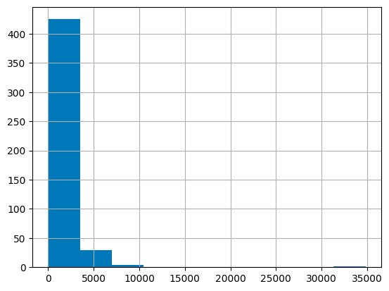
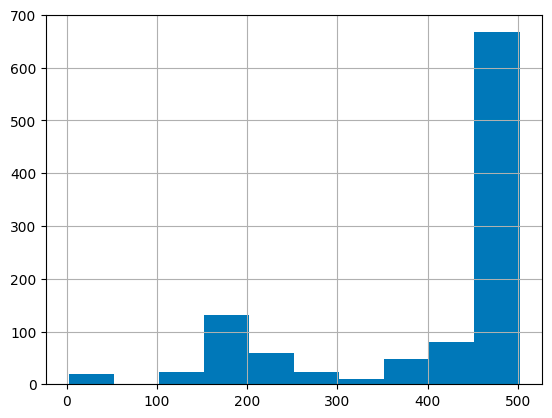

## 基于Embedding模型构建智能问答系统
本部分通过一个简单的示例介绍如何抓取网站（本例中为 OpenAI 网站），使用Embedding API 将抓取的页面转化为Embedding并存储，
然后创建一个基本的搜索功能，允许用户基于存储的信息提问。完整代码请查看：。。。

### 使用Scrapy爬取网站信息
首先，导入所需的软件包，设置基本的 URL，并定义 HTMLParser 类。
```python
import requests
import re
import urllib.request
from bs4 import BeautifulSoup
from collections import deque
from html.parser import HTMLParser
from urllib.parse import urlparse
import os

# 用于匹配URL的正则表达式模式
HTTP_URL_PATTERN = r'^http[s]*://.+'

domain = "openai.com" # <- 将要爬取的域名放在这里
full_url = "https://openai.com/" # <- 将要爬取的域名以https或http形式放在这里

# 创建一个类来解析HTML并获取超链接
class HyperlinkParser(HTMLParser):
    def __init__(self):
        super().__init__()
        # 创建一个列表来存储超链接
        self.hyperlinks = []

    # 重写HTMLParser的handle_starttag方法来获取超链接
    def handle_starttag(self, tag, attrs):
        attrs = dict(attrs)

        # 如果标签是锚标签并且有href属性，则将href属性添加到超链接列表中
        if tag == "a" and "href" in attrs:
            self.hyperlinks.append(attrs["href"])
```
将 URL 作为参数，打开 URL 并读取 HTML 内容。然后，返回在该页面上找到的所有超链接。
```python
import requests
import re
import urllib.request
from bs4 import BeautifulSoup
from collections import deque
from html.parser import HTMLParser
from urllib.parse import urlparse
import os

# 用于匹配URL的正则表达式模式
HTTP_URL_PATTERN = r'^http[s]*://.+'

domain = "openai.com" # <- 将要爬取的域名放在这里
full_url = "https://openai.com/" # <- 将要爬取的域名以https或http形式放在这里

# 创建一个类来解析HTML并获取超链接
class HyperlinkParser(HTMLParser):
    def __init__(self):
        super().__init__()
        # 创建一个列表来存储超链接
        self.hyperlinks = []

    # 重写HTMLParser的handle_starttag方法来获取超链接
    def handle_starttag(self, tag, attrs):
        attrs = dict(attrs)

        # 如果标签是锚标签并且有href属性，则将href属性添加到超链接列表中
        if tag == "a" and "href" in attrs:
            self.hyperlinks.append(attrs["href"])

```
我们的目标是只抓取 OpenAI 域名下的内容并编制索引。为此，我们需要一个调用 `get_hyperlinks` 函数的函数，但要过滤掉不属于指定域的任何 URL。
```python
# 从URL获取同一域名内的超链接的函数
def get_domain_hyperlinks(local_domain, url):
    clean_links = []
    for link in set(get_hyperlinks(url)):
        clean_link = None

        # 如果链接是一个URL，检查它是否在同一域名内
        if re.search(HTTP_URL_PATTERN, link):
            # 解析URL并检查域名是否相同
            url_obj = urlparse(link)
            if url_obj.netloc == local_domain:
                clean_link = link

        # 如果链接不是URL，检查它是否是一个相对链接
        else:
            if link.startswith("/"):
                link = link[1:]
            elif link.startswith("#") or link.startswith("mailto:"):
                continue
            clean_link = "https://" + local_domain + "/" + link

        if clean_link is not None:
            if clean_link.endswith("/"):
                clean_link = clean_link[:-1]
            clean_links.append(clean_link)

    # 返回同一域名内的超链接列表
    return list(set(clean_links))

```
`crawl`是网络搜索任务设置的最后一步。它跟踪访问过的 URL，以避免重复访问同一页面，因为同一页面可能在网站的多个页面中都有链接。它还会提取网页中没有 HTML 标记的原始文本，并将文本内容写入特定于该网页的本地 .txt 文件中。
```python
def crawl(url):
    # 解析URL并获取域名
    local_domain = urlparse(url).netloc

    # 创建一个队列来存储待爬取的URLs
    queue = deque([url])

    # 创建一个集合来存储已经看到的URLs（无重复）
    seen = set([url])

    # 创建一个目录来存储文本文件
    if not os.path.exists("text/"):
            os.mkdir("text/")

    if not os.path.exists("text/"+local_domain+"/"):
            os.mkdir("text/" + local_domain + "/")

    # 创建一个目录来存储csv文件
    if not os.path.exists("processed"):
            os.mkdir("processed")

    # 当队列不为空时，继续爬取
    while queue:

        # 从队列中获取下一个URL
        url = queue.pop()
        print(url) # 用于调试和查看进度

        # 将url的文本保存到<url>.txt文件中
        with open('text/'+local_domain+'/'+url[8:].replace("/", "_") + ".txt", "w", encoding="UTF-8") as f:

            # 使用BeautifulSoup从URL获取文本
            soup = BeautifulSoup(requests.get(url).text, "html.parser")

            # 获取文本但去除标签
            text = soup.get_text()

            # 如果爬虫到达需要JavaScript的页面，它将停止爬取
            if ("You need to enable JavaScript to run this app." in text):
                print("无法解析页面 " + url + " 因为需要启用JavaScript")

            # 否则，将文本写入text目录下的文件
            f.write(text)

        # 从URL获取超链接并将它们添加到队列中
        for link in get_domain_hyperlinks(local_domain, url):
            if link not in seen:
                queue.append(link)
                seen.add(link)

crawl(full_url)
```
上述示例的最后一行运行爬网程序，该程序会浏览所有可访问链接，并将这些页面转化为文本文件。根据网站的大小和复杂程度，这需要几分钟的时间。

### 构建Embedding索引
要将文本转换为 CSV，需要循环浏览之前创建的文本目录中的文本文件。打开每个文件后，删除多余的行距，并将修改后的文本添加到列表中。然后，将删除了新行的文本添加到一个空的 Pandas 数据框中，并将数据框写入 CSV 文件。
```python
import pandas as pd

def remove_newlines(serie):
    serie = serie.str.replace('\n', ' ')
    serie = serie.str.replace('\\n', ' ')
    serie = serie.str.replace('  ', ' ')
    serie = serie.str.replace('  ', ' ')
    return serie

# 创建一个列表来存储文本文件
texts=[]

# 获取text目录中的所有文本文件
for file in os.listdir("text/" + domain + "/"):

    # 打开文件并读取文本
    with open("text/" + domain + "/" + file, "r", encoding="UTF-8") as f:
        text = f.read()

        # 省略前11行和最后4行，然后将-、_和#update替换为空格。
        texts.append((file[11:-4].replace('-',' ').replace('_', ' ').replace('#update',''), text))

# 从文本列表创建一个dataframe
df = pd.DataFrame(texts, columns = ['fname', 'text'])

# 将text列设置为删除了换行符的原始文本
df['text'] = df['fname'] + ". " + df['text'].replace('\n', ' ')
df.to_csv('processed/scraped.csv')
df.head()
```
将原始文本保存到 CSV 文件后，下一步是Tokenization。此过程通过分解句子和单词将输入文本拆分为tokens。
>一个有用的经验法则是，一个token通常对应于常见英语文本的 4 个字符。相当于大约 3/4 个单词（因此 100 个标记 ~= 75 个单词）。

API 对Embedding的输入token的最大数量有限制。为了保证不超过限制，CSV 文件中的文本需要分解为多行。首先记录每行现有的长度，以识别哪些行需要拆分。
```python
import tiktoken

# 加载cl100k_base分词器，它设计用于与ada-002模型一起工作
tokenizer = tiktoken.get_encoding("cl100k_base")

df = pd.read_csv('processed/scraped.csv', index_col=0)
df.columns = ['title', 'text']

# 对文本进行分词，并将分词数保存到新的列中
df['n_tokens'] = df.text.apply(lambda x: len(tokenizer.encode(x)))

# 使用直方图可视化每行的分词数量分布
df.n_tokens.hist()
```


最新的Embedding模型可以处理多达 8191 个输入标记的输入，因此大部分行都不需要任何分块，但并不是每个子页面都需要分块，因此下一个代码块将把较长的行分割成较小的块。
```python
max_tokens = 500

# 函数用于将文本拆分为最大令牌数的多个块
def split_into_many(text, max_tokens = max_tokens):

    # 将文本拆分成句子
    sentences = text.split('. ')

    # 获取每个句子的令牌数
    n_tokens = [len(tokenizer.encode(" " + sentence)) for sentence in sentences]

    chunks = []
    tokens_so_far = 0
    chunk = []

    # 遍历元组中联合的句子和令牌
    for sentence, token in zip(sentences, n_tokens):

        # 如果到目前为止的令牌数加上当前句子的令牌数大于最大令牌数，则将块添加到块列表中，并重置
        # 块和到目前为止的令牌
        if tokens_so_far + token > max_tokens:
            chunks.append(". ".join(chunk) + ".")
            chunk = []
            tokens_so_far = 0

        # 如果当前句子的令牌数大于最大令牌数，跳到下一句
        if token > max_tokens:
            continue

        # 否则，将句子添加到块中，并将令牌数加到总数上
        chunk.append(sentence)
        tokens_so_far += token + 1

    return chunks


shortened = []

# 遍历数据帧
for row in df.iterrows():

    # 如果文本为None，跳到下一行
    if row[1]['text'] is None:
        continue

    # 如果令牌数大于最大令牌数，将文本拆分成多个块
    if row[1]['n_tokens'] > max_tokens:
        shortened += split_into_many(row[1]['text'])

    # 否则，将文本添加到缩短文本列表中
    else:
        shortened.append(row[1]['text'])

```
再次可视化更新后的直方图有助于确认行是否已成功拆分为缩短的部分。
```python
df = pd.DataFrame(shortened, columns = ['text'])
df['n_tokens'] = df.text.apply(lambda x: len(tokenizer.encode(x)))
df.n_tokens.hist()
```

现在，内容被分解成更小的块，可以向 OpenAI API 发送一个简单的请求，指定使用新的text-embedding-ada-002  模型来创建embedding:
```python
from openai import OpenAI

client = OpenAI(
    api_key=os.environ.get("OPENAI_API_KEY"),
)

df['embeddings'] = df.text.apply(lambda x: client.embeddings.create(input=x, engine='text-embedding-ada-002')['data'][0]['embedding'])

df.to_csv('processed/embeddings.csv')
df.head()
```
这应该需要大约 3-5 分钟，但之后您的嵌入就可以使用了！

## 根据Embedding构建智能问答系统
第一步是将嵌入数据转化为 NumPy 数组，这将为如何使用嵌入数据提供更多灵活性，因为有许多函数可以对 NumPy 数组进行操作。它还会将维度扁平化为 1-D，这是许多后续操作所需的格式。
```python
import numpy as np
from openai.embeddings_utils import distances_from_embeddings

df=pd.read_csv('processed/embeddings.csv', index_col=0)
df['embeddings'] = df['embeddings'].apply(eval).apply(np.array)

df.head()
```
现在数据已经准备好，需要将问题转换为具有简单函数的嵌入。这很重要，因为嵌入搜索使用余弦距离比较数字向量（这是原始文本的转换）。这些向量可能是相关的，如果它们的余弦距离接近，则可能是问题的答案。 OpenAI python 包有一个内置的 distances_from_embeddings 函数，在这里很有用。
```python
def create_context(
    question, df, max_len=1800, size="ada"
):
    """
    通过查找数据框中最相似的上下文为问题创建上下文
    """

    # 获取问题的嵌入向量
    q_embeddings = client.embeddings.create(input=question, engine='text-embedding-ada-002')['data'][0]['embedding']

    # 获取嵌入向量之间的距离
    df['distances'] = distances_from_embeddings(q_embeddings, df['embeddings'].values, distance_metric='cosine')


    returns = []
    cur_len = 0

    # 按距离排序，并添加文本到上下文中，直到上下文太长为止
    for i, row in df.sort_values('distances', ascending=True).iterrows():

        # 将文本的长度添加到当前长度
        cur_len += row['n_tokens'] + 4

        # 如果上下文太长，则中断
        if cur_len > max_len:
            break

        # 否则，将其添加到正在返回的文本中
        returns.append(row["text"])

    # 返回上下文
    return "\n\n###\n\n".join(returns)

```
文本被分解成较小的标记集，因此按升序循环并继续添加文本是确保完整答案的关键步骤。如果返回的内容超出预期，也可以将 max_len 修改得更小。

上一步只检索了与问题语义相关的文本块，因此它们可能包含答案，但不能保证一定包含答案。通过返回最有可能的前 5 个结果，可以进一步提高找到答案的几率。

然后，答题提示会尝试从检索到的上下文中提取相关事实，以形成一个连贯的答案。如果没有相关答案，提示符将返回 "我不知道"。

可以通过使用 gpt-3.5-turbo-instruct 的完成终点来创建一个听起来逼真的问题答案。
```python
def answer_question(
    df,
    model="gpt-3.5-turbo",
    question="我可以在不经人工审核的情况下将模型输出发布到Twitter吗？",
    max_len=1800,
    size="ada",
    debug=False,
    max_tokens=150,
    stop_sequence=None
):
    """
    基于数据框文本中最相似的上下文回答问题
    """
    context = create_context(
        question,
        df,
        max_len=max_len,
        size=size,
    )
    # 如果调试，打印原始模型响应
    if debug:
        print("上下文:\n" + context)
        print("\n\n")

    try:
        # 使用问题和上下文创建聊天完成
        response = client.chat.completions.create(
            model="gpt-3.5-turbo",
            messages=[
                {"role": "system", "content": "基于下面的上下文回答问题，如果问题无法基于上下文回答，就说“我不知道”\n\n"},
                {"role": "user", f"content": "上下文: {context}\n\n---\n\n问题: {question}\n回答:"}
            ],
            temperature=0,
            max_tokens=max_tokens,
            top_p=1,
            frequency_penalty=0,
            presence_penalty=0,
            stop=stop_sequence,
        )
        return response.choices[0].message.strip()
    except Exception as e:
        print(e)
        return ""

```
完成了！一个嵌入了 OpenAI 网站知识的 Q/A 系统现已准备就绪。可以进行一些快速测试来查看输出的质量：
```python
answer_question(df, question="What day is it?", debug=False)

answer_question(df, question="What is our newest embeddings model?")

answer_question(df, question="What is ChatGPT?")
```
返回的结果可能是：
```text
"I don't know."

'The newest embeddings model is text-embedding-ada-002.'

'ChatGPT is a model trained to interact in a conversational way. It is able to answer followup questions, admit its mistakes, challenge incorrect premises, and reject inappropriate requests.'
```
如果系统无法回答预期的问题，则值得搜索原始文本文件，以查看预期已知的信息是否实际上最终被嵌入。最初完成的爬网过程被设置为跳过所提供的原始域之外的站点，因此如果存在子域设置，它可能不知道这些信息。

目前，每次都会传递数据帧来回答问题。对于更多的生产工作流程，应使用矢量数据库解决方案，而不是将嵌入存储在 CSV 文件中，但当前的方法是原型设计的绝佳选择。

